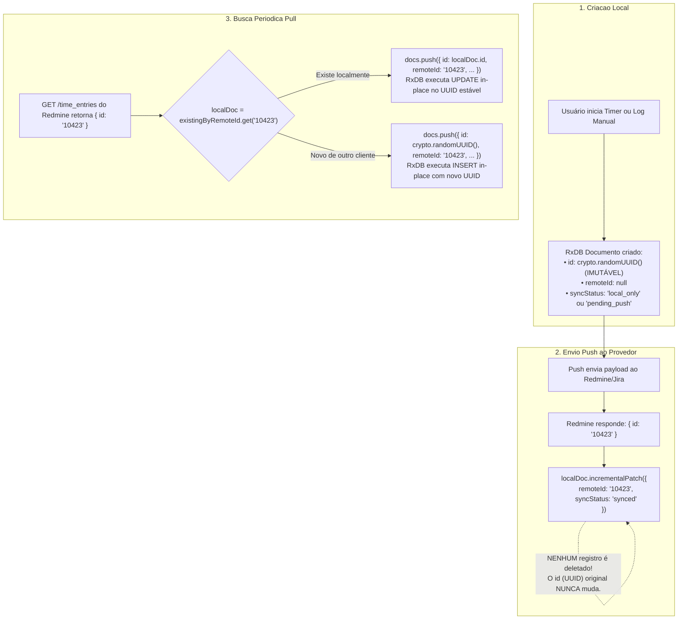

# ADR-006 — Identidade Imutável de Apontamentos de Tempo (Stable Client UUID) e Desacoplamento de Identificadores Remotos

## Status

**Aprovado**

## Data

21 de Setembro de 2026

## Autor

Gustavo Henrique Pereira dos Santos

---

## 1. Contexto

No ecossistema Mr-tick, apontamentos de tempo (*Time Entries*) possuem uma característica única em relação a Tarefas e Metadados: **eles nascem no cliente (Local-First)** através de cronômetros em tempo real, sugestões de IA ou logs manuais, e posteriormente sincronizam com provedores remotos (ex: Redmine, Jira, Tick).

### 1.1 O Problema da Chave Composta Mutável

O schema inicial do RxDB definia a chave primária de apontamentos de tempo como uma chave composta:
```typescript
primaryKey: {
  key: 'id',
  fields: ['connectionInstanceId', 'sourceId'],
  separator: '::'
}
```

Essa definição gerou um conflito estrutural profundo:
1. **Identidade Provisória vs Definitiva**: Ao nascer localmente, o apontamento não possui identificador do provedor externo, sendo instanciado com `sourceId: 'local-uuid'`.
2. **Autoridade do Provedor**: Quando enviado via *Push* ao Redmine ou Jira, o servidor remoto gera seu próprio identificador sequencial ou alfanumérico (ex: `10423`).
3. **Imutabilidade de Chaves Primárias no RxDB**: O RxDB (e a maioria dos bancos NoSQL) proíbe expressamente a alteração da chave primária de um documento existente.
4. **Anti-pattern `remove + insert`**: Para que o documento local passasse a refletir o ID do Redmine (`connection::10423`) e se correlacionasse com os *Pulls* subsequentes, o sistema era forçado a deletar o documento local original e inserir um novo registro com a nova chave composta.
5. **Efeitos Colaterais**:
   - Disparo duplo de eventos de exclusão e inserção no React, gerando *flickers* visuais e perda de foco/seleção de linha.
   - Condição de corrida (*race condition*): se um *Pull* ocorresse concorrentemente antes da finalização da troca de chaves, o registro do Redmine era inserido como um segundo documento, gerando **duplicação visual e de horas**.
   - Proliferação de gambiarras defensivas na UI e nos hooks para checagem dupla constante: `if (item.id === ... || item.sourceId === ...)`.

---

## 2. Decisão

Adota-se o padrão **Client-Generated Stable UUID** com **Desacoplamento de Chave Externa** para a coleção `timeEntries`.



### 2.1 Identificador Primário Estável e Sagrado (`id`)
- O campo `id` torna-se a chave primária única da coleção (`primaryKey: 'id'`).
- É gerado no cliente via `crypto.randomUUID()` no momento da criação da entidade.
- **Permanece imutável por todo o ciclo de vida do registro.**

### 2.2 Identificador Remoto como Foreign Key (`remoteId`)
- O identificador gerado pelo Redmine/Jira/Tick passa a ser armazenado estritamente no campo secundário `remoteId: string | null`.
- O campo é indexado no schema do RxDB (`indexes: ['connectionInstanceId', 'remoteId', ...]`) permitindo buscas em tempo $O(1)$.
- Ao receber resposta do provedor remoto, o documento sofre apenas um `incrementalPatch({ remoteId, syncStatus: 'synced' })`.

### 2.3 Eliminação de Campos Zumbis e Redundantes
Para manter a tipagem estrita e o schema limpo (conforme [GEMINI.md](../GEMINI.md)):

| Campo Removido | Motivo da Remoção |
| :--- | :--- |
| `sourceId` | Redundante e causa-raiz da duplicidade conceitual. O ID do provedor é exclusivamente `remoteId`. |
| `conflicted: boolean` | Redundante com `syncStatus === 'conflict'`. A fonte única de verdade é o enum `syncStatus`. |
| `syncStatus: 'pulling'` | Estado morto, nunca utilizado em regras de negócio. |
| `lastReconciledAt` (no documento) | O controle de sweep window pertence à Store de sincronização da conexão, não ao documento individual. |

### 2.4 Máquina de Estados de Sincronização Enxuta

```typescript
export type RecordSyncStatus =
  | 'local_only'    // Timer rodando ou apontamento sem atividade/tarefa (não enviar)
  | 'pending_push' // Apontamento completo e válido, pronto para envio
  | 'synced'       // Confirmado no servidor remoto (possui remoteId)
  | 'conflict'     // Divergência detectada pelo servidor remoto
  | 'error'        // Erro de validação retornado pelo servidor remoto
```

---

## 3. Detalhamento dos Fluxos do Ciclo de Vida

### 3.1 Criação Local
```typescript
const id = crypto.randomUUID()
const newEntry: SyncTimeEntryRxDBDTO = {
  id,
  connectionInstanceId,
  dataSourceId,
  _deleted: false,
  remoteId: null,
  syncStatus: isReady ? 'pending_push' : 'local_only',
  // ... dados de tarefa, atividade, tempo
}
```

### 3.2 Envio Remoto (Push)
1. O serviço envia o array de DTOs ao adaptador remoto.
2. Na resposta de sucesso, o Redmine retorna `{ id: '10423', originalId: doc.id }`.
3. O push handler localiza o documento pelo `originalId` e executa:
   ```typescript
   await localDoc.incrementalPatch({
     remoteId: String(item.id),
     syncStatus: 'synced',
     lastPushedAt: nowIso,
     syncError: null,
   })
   ```
4. **Zero operações de remoção.**

### 3.3 Recepção e Reconciliação (Pull)
1. O *Pull* consulta previamente todos os documentos locais da conexão e monta um mapa:
   ```typescript
   const existingByRemoteId = new Map<string, SyncTimeEntryRxDBDTO>()
   for (const doc of existingDocs) {
     if (doc.remoteId) existingByRemoteId.set(doc.remoteId, doc.toMutableJSON())
   }
   ```
2. Para cada item retornado pela API remota com ID `remoteId`:
   - Se existir no mapa: utiliza `id = existingDoc.id`. O RxDB realiza um **update** atômico nos campos de tempo e texto.
   - Se não existir: gera `id = crypto.randomUUID()`. O RxDB realiza um **insert** limpo.

### 3.4 Alteração de Conexão
No modelo legado, transferir um apontamento para outra conexão exigia deletar e reinserir devido à chave primária composta. No modelo atual, mudar de conexão torna-se um simples patch de atributo:
```typescript
await doc.incrementalPatch({
  connectionInstanceId: novaConexaoId,
  remoteId: null,
  syncStatus: 'pending_push',
})
```

### 3.5 Exclusão (Delete)
- **Apontamento nunca sincronizado (`remoteId === null`)**: deletado instantaneamente do banco local com `doc.remove()`, sem gastar tráfego de rede.
- **Apontamento sincronizado (`remoteId !== null`)**: marcado com `_deleted: true` e `syncStatus: 'pending_push'` para que o próximo ciclo de push envie o `DELETE` ao Redmine/Jira.

### 3.6 Contrato Atômico de Mutação em Gateways (Create e Update) vs. Anti-pattern de Busca Posterior

Uma dúvida clássica de arquitetura é se métodos de mutação em Gateways/Providers deveriam ser `void`, baseando-se no princípio formal de **CQS (Command-Query Separation)**.

#### Onde o CQS Estrito (`void`) se Aplica vs Onde Falha
- **Válido para Domínio e Repositórios Locais**: Quando a aplicação é a dona absoluta do banco e gera seus próprios IDs antes de salvar, `repository.create(entity): Promise<void>` e `update(entity): Promise<void>` são padrões canônicos de DDD/CQS, pois quem invocou o repositório já detém o ID (Client-Generated UUID) e o estado íntegro do agregado.
- **Anti-pattern em Gateways Externos**: Quando a entidade é persistida ou alterada em um servidor remoto de terceiros (Redmine, Jira, GitLab, GitHub, Asana), **a autoridade sobre a identidade e metadados do recurso pertence ao terceiro**:
  - No `create`: O servidor remoto gera seu próprio identificador (ex: ID numérico `#10423` no Redmine ou Issue Key `PROJ-42` no Jira) retornado na resposta `HTTP 201 Created`. Se o método `create(...)` do Gateway retornar `void`, ele descarta a informação mais crítica da transação e força o sistema a tentar uma adivinhação posterior.
  - No `update`: O servidor remoto atualiza o carimbo de data/hora no seu relógio oficial (`updated_on = "2026-09-22T11:52:10.500Z"`). Se o método `update(...)` retornar `void`, o cliente fica desalinhado (mantendo seu timestamp de relógio local) e o próximo `pull()` detectará divergência indevida, gerando **falsos conflitos ou sobrescritas desnecessárias**.

#### Por Que "Consultar Depois" (Search-After-Create/Update) Falha em Produção:
1. **Ambiguidade e Colisão Legítima de Dados**:
   - Um desenvolvedor pode registrar 1h na tarefa `#DOC-131` pela manhã e mais 1h na mesma tarefa à tarde.
   - Ambos os registros compartilham o mesmo usuário, mesma tarefa, mesma atividade e mesma data (`2026-09-22`).
   - Se o sistema consultar o Redmine após o envio para tentar "descobrir" qual ID foi criado, é **impossível determinar com certeza matemática** qual entrada corresponde ao envio atual e qual era o apontamento anterior.
2. **Condições de Corrida (*Race Conditions*)**:
   - Entre o `POST` de criação e o `GET` de busca, outro processo, timer ou usuário pode criar registros concorrentes.
   - Sistemas distribuídos com réplicas de leitura podem apresentar atraso de replicação (*eventual consistency*), fazendo com que o `GET` retorne vazio imediatamente após o `POST`.
3. **Quebra de Atomicidade e Duplicação de Latência**:
   - Na chamada de criação/atualização, a conexão HTTP já está aberta e o servidor remoto **já devolveu o ID e os timestamps no corpo da resposta**.
   - Descartar essa resposta para realizar um segundo round-trip de rede dobra a latência e abre janelas desnecessárias de falha de conexão.

#### Matriz Decisória de Tipos de Retorno no Monorepo:

| Camada / Interface | Método | Retorno | Justificativa Arquitetural |
| :--- | :--- | :--- | :--- |
| **Gateway Remoto** (`ITimeEntryProvider`) | `create(entry)` | `Promise<CreatedTimeEntryResult \| void>` | O servidor remoto aloca o `id` e o `updatedAt`. Deve retornar `{ id, updatedAt }`. |
| **Gateway Remoto** (`ITimeEntryProvider`) | `update(entry)` | `Promise<UpdatedTimeEntryResult \| void>` | O servidor remoto confirma o `id` e atualiza seu `updatedAt` oficial. |
| **Gateway Remoto** (`ITaskProvider`) | `create(task)` | `Promise<CreatedTaskResult \| void>` | Criação remota de Issue/Task aloca nova chave remota no provedor (Redmine/Jira). |
| **Gateway Remoto** (`ITaskProvider`) | `update(task)` | `Promise<UpdatedTaskResult \| void>` | Atualização remota de Issue/Task confirma estado e timestamp oficial do servidor. |
| **Gateway Remoto** (Qualquer Provider) | `delete(id)` | `Promise<void>` | Remoção é idempotente por ID; não gera novo identificador nem timestamp. |
| **Repositório Local** (`IRepositoryBase`) | `create(entity)` | `Promise<void>` | O domínio gera o UUID local antes do salvamento; DDD/CQS puro. |
| **Repositório Local** (`IRepositoryBase`) | `update(entity)` | `Promise<void>` | O domínio controla o estado e timestamp local; DDD/CQS puro. |
| **Repositório Local** (`IRepositoryBase`) | `delete(id)` | `Promise<void>` | Descarte local de documento por ID primário. |

#### O Fluxo de Sincronização Atômica Adotado:
```
[Client] --- POST (payload + originalId: local-uuid) ---> [Gateway / Remote Server]
[Client] <-- HTTP 201 { id: "10423", updatedAt: ... } --- [Gateway / Remote Server]
   |
   +---> patch atômico: { remoteId: "10423", updatedAt: remoteUpdatedAt, syncStatus: "synced" }
```
- Os contratos [`ITimeEntryProvider`](file:///c:/myapps/metric-context/metric/src/packages/application/src/contracts/data/providers/ITimeEntryProvider.ts) e [`ITaskProvider`](file:///c:/myapps/metric-context/metric/src/packages/application/src/contracts/data/providers/ITaskProvider.ts) seguem rigorosamente este padrão.
- O cliente associa o `remoteId` e o `updatedAt` de forma determinística e imediata na mesma transação.
- Trava de concorrência em voo (`inFlightPushDocIds`) impede que o mesmo documento seja despachado mais de uma vez em paralelo.
- No `pull()`, os timestamps entre local e remoto coincidem com exatidão, eliminando reprocessamento.

### 3.7 Duplicação em Ghost Mode e Isolamento de `remoteId`

A operação de duplicar (*clone*) um apontamento segue o padrão **Ghost Mode** com isolamento total de identificadores:

1. **Entrada em Ghost Mode (Draft Pré-populado)**:
   - Ao clicar em "Duplicar", a linha não é persistida de imediato no banco de dados. Ela nasce como um rascunho em memória (`isDraft: true`, `id: 'temp-draft-' + crypto.randomUUID()`).
   - A linha entra em modo de edição com todos os campos pré-preenchidos a partir da linha de origem (`task`, `taskData`, `activity`, `user`, `startDate`, `endDate`, `timeSpent`, `comments`, `connectionInstanceId`, `dataSourceId`).
   - O `remoteId` nasce rigorosamente `null`, garantindo que o rascunho não herde nenhum vínculo externo.
   - O usuário tem autonomia para alterar qualquer campo, **Confirmar (Salvar)** ou **Descartar (Cancelar)**.

2. **Descarte (Cancelar)**:
   - Ao clicar no botão de cancelar, o rascunho é descartado da memória sem tocar no RxDB nem disparar qualquer sincronização de rede.

3. **Confirmação (Salvar)**:
   - Ao clicar em Salvar, o rascunho é validado (`timeSpent > 0`) e recebe um identificador estável definitivo `id: crypto.randomUUID()`.
   - É inserido no RxDB com `remoteId: null` e `syncStatus: isRemoteCandidate ? 'pending_push' : 'local_only'`.
   - Aciona o envio remoto via `forceSync(connectionInstanceId, 'push')` em segundo plano.

4. **Proteção Contra Sobregravação no Servidor Remoto / Provedor**:
   - Provedores e armazenamentos (incluindo `FakeDatabaseStore`) identificam entidades exclusivamente por `item.id === entity.id`.
   - Heurísticas semânticas baseadas em proximidade de horário (ex: `Math.abs(itemStart - entityStart) < 10000`) foram banidas, preservando o apontamento original e o duplicado mesmo que compartilhem o mesmo timestamp de início.

5. **Blindagem na Replicação (`TimeEntriesReplication.pull`)**:
   - Documentos locais com status `'pending_push'` ou `'local_only'` nunca são capturados pela busca aproximada (`matchedDoc`).
   - Ao recarregar a página (`F5`) após salvar, ambos os apontamentos possuem seus próprios IDs locais e remotos, garantindo que `seenRemoteIds` e `reconcile` mantenham ambas as linhas intactas.

---

## 4. Consequências e Benefícios

### Positivas
- **Fim Definitivo de Duplicações**: A chave primária nunca muda; colisões entre push e pull tornam-se impossíveis.
- **UI Estável e Reativa**: A ausência de `remove + insert` elimina flickers na tabela, preserva o foco do usuário e estabiliza renderizações do React.
- **Simplificação Drástica de Código**: Elimina dezenas de checagens duplas (`item.id || item.sourceId`) e desnecessárias manipulações de strings (`split('::')`) nos componentes e hooks.
- **Conformidade com Padrões do GEMINI.md**:
  - Respeito à Regra 13 (Isolamento de Identificadores — fim de chaves compostas locais).
  - Respeito à Regra 5 (Sem Gambiarras).
  - Respeito à Regra 11 (Refatoração Limpa Ativa na raiz).
  - Respeito à Regra 14 (Early return estrito nos handlers).

### Considerações Operacionais
- A definição do schema permanece em `version: 0` durante a fase de desenvolvimento/experimentos.
- Bancos de dados locais de teste contendo registros legados com chave composta devem ser reiniciados através de `resetDatabase()` ou limpeza de storage local.
