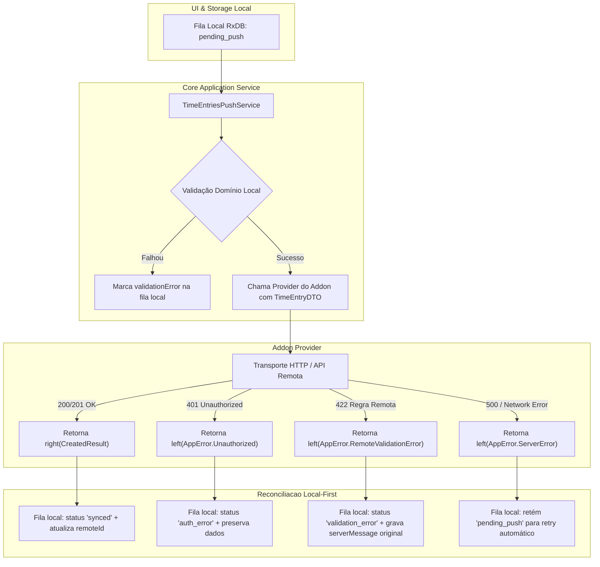

# ADR-007 — Padronização Funcional de Contratos de Addons, Tratamento Determinístico com Either e Desacoplamento Limpo do SDK

## Status

**Aprovado (Refatoração Direta na Raiz)**

## Data

24 de Setembro de 2026

## Autor

Gustavo Henrique Pereira dos Santos

---

## 1. Contexto & Diagnóstico da Maturidade Atual

A arquitetura de extensibilidade do **Mr-tick** permite a integração de provedores externos (ex: Jira, Redmine, YouTrack, Tick) através de plugins (Addons) carregados via `@mr-tick/sdk`.

O projeto encontra-se em **fase de desenvolvimento ativo e testes**, sem base instalada externa ou ecossistema público em produção. Isso nos dá a liberdade e o dever arquitetural (conforme a **Regra 11 do GEMINI.md**) de **não aplicar remendos, adaptadores legados ou camadas intermediárias desnecessárias**, corrigindo qualquer inconsistência diretamente na raiz.

Identificou-se que os contratos atuais entre o Core e os Addons possuem assimetrias conceituais graves que violam as diretrizes de engenharia do projeto:

---

### 1.1 Assimetria Funcional no Tratamento de Erros (`pull` vs Mutações)

Atualmente, o pipeline de sincronização opera com contratos assimétricos para operações que realizam o mesmo tipo de I/O de rede:

1. **`ITimeEntryProvider.pull`**:
   ```typescript
   pull(
     memberId: string,
     checkpoint: { updatedAt: Date; id: string },
     batch: number,
   ): Promise<Either<AppError, TimeEntryDTO[]>>
   ```
   *Usa `Either` funcional corretamente, permitindo ao `SyncEngine` capturar falhas de autenticação (`401`) e rede sem lançar exceções.*

2. **`ITaskProvider.pull`**:
   ```typescript
   pull(
     memberId: string,
     checkpoint: { updatedAt: Date; id: string },
     batch: number,
   ): Promise<TaskDTO[]>
   ```
   *Não usa `Either`! Retorna array puro ou lança exceção em caso de erro, criando assimetria direta dentro da mesma etapa de sincronização.*

3. **Mutações Remotas (`create`, `update`, `delete`)**:
   ```typescript
   create(entry: TimeEntry): Promise<CreatedTimeEntryResult | void>
   update(entry: TimeEntry): Promise<UpdatedTimeEntryResult | void>
   delete(id: string): Promise<void>
   ```
   *Não utilizam `Either`. Retornam tipos primitivos ou `void`.*

---

### 1.2 Violação da Regra 19 (GEMINI.md) nas Mutações

A Regra 19 do projeto estabelece:
> *"Tratamento Funcional de Erros com Either (Proibição de Exceptions e String Matching de Erro): O projeto NÃO trabalha com exceptions (throw) para controle de fluxo nem captura genérica de erros com try/catch... Erros de rede, requisições externas e integrações com provedores DEVEM ser capturados e encapsulados no nível mais baixo possível e convertidos imediatamente em instâncias de Either<AppError, T>."*

Como os métodos `create`, `update` e `delete` não retornam `Either`:
- Se a API remota responder com `401 Unauthorized`, `403 Forbidden`, `422 Unprocessable Entity`, `500 Internal Error` ou *timeout*, a única maneira de o provedor do addon sinalizar falha é executando **`throw new Error(...)`**.
- No `TimeEntriesPushService`, isso força a execução a interromper abruptamente o ciclo de envio da fila ou gera falhas não tratadas na IPC do Electron (`IpcMainInvokeEvent`).
- O sistema perde a capacidade de marcar o item da fila local com o status exato de falha (`auth_error`, `server_error`, `validationError`), enfraquecendo a resiliência *Local-First*.

---

### 1.3 Acoplamento Estrutural entre `@mr-tick/sdk` e `@mr-tick/application`

O pacote público `@mr-tick/sdk` atualmente reexporta e depende de interfaces e classes internas de `@mr-tick/application`:
- Métodos como `create(entry: TimeEntry)` no provider exigem a entidade de domínio `TimeEntry` da aplicação.
- Isso viola o isolamento de fronteiras: qualquer refatoração interna de domínio no Core quebra os contratos do SDK.
- O SDK deve trabalhar exclusivamente com **DTOs canônicos puros** (`TimeEntryDTO`, `TaskDTO`, etc.).

---

### 1.4 Ausência de `testConnection` / `healthCheck` Determinístico

Atualmente, para validar se as credenciais de uma conexão recém-configurada funcionam, o Core depende de executar `authenticate` ou forçar um `pull` preliminar. Não existe um método formalizado e padronizado para verificação de conectividade e integridade do endpoint remoto.

---

### 1.5 Tratamento de Mensagens de Erro do Servidor Remoto (Regra 17)

Quando o servidor remoto rejeita uma mutação por regra própria (ex: *"Ticket fechado para apontamentos"*, *"Tempo inserido excede limite diário"*):
- O Core precisa gravar e exibir exatamente a chave ou mensagem original retornada pelo provedor (`messageKey`, `details`), sem mascarar ou traduzir.
- Sem um DTO padronizado de erro encapsulado em `Either.failure`, essas mensagens técnicas acabam perdidas ou convertidas em erros genéricos na UI.

---

## 2. Decisão Arquitetural: Refatoração Direta e Limpa na Raiz

Como o projeto está em desenvolvimento ativo e sem consumidores legados externos, **rejeita-se a criação de `LegacyProviderAdapter`, conversores legados ou períodos de convivência artificial**. A refatoração será feita diretamente na raiz dos contratos.



---

### 2.1 Novos Contratos Unificados com `Either<AppError, T>` no SDK

Todas as operações remotas com I/O passam a retornar deterministicamente `Promise<Either<AppError, T>>`:

#### A. `ITimeEntryProvider`
```typescript
export interface ITimeEntryProvider {
  pull(
    memberId: string,
    checkpoint: { updatedAt: Date; id: string },
    batch: number,
  ): Promise<Either<AppError, TimeEntryDTO[]>>

  create(
    entry: TimeEntryDTO,
  ): Promise<Either<AppError, CreatedTimeEntryResult>>

  update(
    entry: TimeEntryDTO,
  ): Promise<Either<AppError, UpdatedTimeEntryResult>>

  delete(
    remoteId: string,
  ): Promise<Either<AppError, void>>

  findByMemberId(
    memberId: string,
    startDate: Date,
    endDate: Date,
  ): Promise<Either<AppError, PagedResultDTO<TimeEntryDTO>>>
}
```

#### B. `ITaskProvider`
```typescript
export interface ITaskProvider {
  pull(
    memberId: string,
    checkpoint: { updatedAt: Date; id: string },
    batch: number,
  ): Promise<Either<AppError, TaskDTO[]>>

  create(
    task: TaskDTO,
  ): Promise<Either<AppError, CreatedTaskResult>>

  update(
    task: TaskDTO,
  ): Promise<Either<AppError, UpdatedTaskResult>>

  delete(
    remoteId: string,
  ): Promise<Either<AppError, void>>

  findAll(
    pagination?: PaginationOptionsDTO,
  ): Promise<Either<AppError, PagedResultDTO<TaskDTO>>>

  findById(
    id: string,
  ): Promise<Either<AppError, TaskDTO | undefined>>
}
```

#### C. `IDataSourceInstance` (com `testConnection`)
```typescript
export interface IDataSourceInstance {
  testConnection(): Promise<Either<AppError, ConnectionHealthDTO>>
  readonly authStrategy: IAuthenticationStrategy
  readonly tasksProvider: ITaskProvider
  readonly timeEntriesProvider: ITimeEntryProvider
  readonly membersProvider: IMemberProvider
  readonly metadataProvider: IMetadataProvider
}
```

---

### 2.2 Desacoplamento Estrito do SDK via DTOs Canônicos

- `@mr-tick/sdk` não mais importará classes de domínio (`TimeEntry`, `Task`) nem entidades internas de `@mr-tick/application`.
- Os provedores receberão e retornarão exclusivamente **DTOs canônicos puros** (`TimeEntryDTO`, `TaskDTO`).
- A conversão entre DTOs externos e Entidades de Domínio internas ocorre exclusivamente na camada de aplicação do Core (`@mr-tick/application`), isolando o domínio.

---

### 2.3 Padronização do Manifesto (`manifest.yaml`)

Como não há legado externo, o `manifest.yaml` adota diretamente o schema padronizado e simplificado:

```yaml
id: mr-tick-datasource-fake
name: DataSource Fake (Testes)
version: 1.0.0
categories:
  - dataSource
author: Mr-tick
shortDescription: Datasource mock para testes
description: Datasource com dados locais fixos para testes e validação de envio de dados.
tags:
  - teste
  - mock
  - dataSource
```

---

## 3. Plano de Implementação

1. **Camada de Contratos (`@mr-tick/sdk` & `@mr-tick/application`)**:
   - Ajustar as interfaces `ITimeEntryProvider`, `ITaskProvider` e `IDataSourceInstance` para utilizarem `Either<AppError, T>` e DTOs puros.
2. **Serviços do Core (`TimeEntriesPushService`, `TasksPushService`, `SyncEngine`)**:
   - Ajustar o consumo dos métodos `create`, `update` e `delete` para tratar retornos funcionais `result.isFailure()` e atualizar o status da fila de sync local sem blocos `try/catch` artificiais.
3. **Addons Internos (`src/dev-addons/datasource-fake`)**:
   - Atualizar a implementação do provider fake para retornar `right(...)` ou `left(AppError...)` diretamente.
4. **Verificação de Tipos e E2E**:
   - Executar `yarn typecheck` na raiz e rodar a suíte completa de testes E2E.

---

## 4. Consequências

### Positivas
- **Eliminação Total de Gambiarras e Adapters Mortos**: Sem classes de compatibilidade legada ou conversões intermediárias. Código 100% enxuto e direto.
- **Conformidade Total com GEMINI.md**: Regra 11 (sem remendos), Regra 19 (Either ponta a ponta) e Regra 17 (mensagens de erro do servidor).
- **Tratamento Determinístico de Falhas**: Erros de autenticação (401), regras de negócio remotas (422) e indisponibilidade de servidor (500) fluem de forma tipada e segura até a interface do usuário.
- **Isolamento Arquitetural**: O SDK torna-se agnóstico e independente do domínio interno da aplicação.
